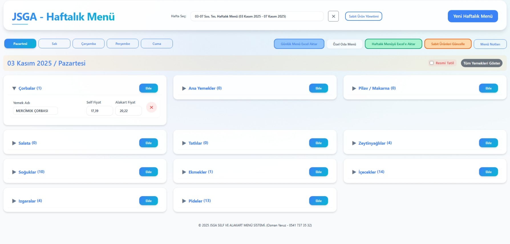
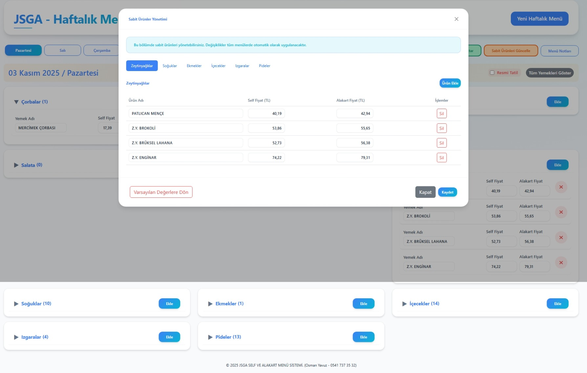

# 🍽️ Jandarma ve Sahil Güvenlik Akademisi - Haftalık Menü Yönetim Sistemi

**Jandarma ve Sahil Güvenlik Akademisi Sosyal Tesisler Müdürlüğü**  
**Lokanta Kısım Amirliği**





---

## 📖 **İçindekiler**

- [Genel Bakış](#-genel-bakış)
- [Özellikler](#-özellikler)
- [Proje Yapısı](#️-proje-yapısı)
- [Ana Fonksiyonlar](#-ana-fonksiyonlar)
- [Kullanım Kılavuzu](#-kullanım)
- [Teknik Detaylar](#️-teknik-detaylar)
- [UI Özellikleri](#-ui-özellikleri)
- [Veri Güvenliği](#-veri-güvenliği)
- [Bilinen Sorunlar](#-bilinen-sorunlar-ve-çözümler)
- [Destek ve İletişim](#-destek-ve-iletişim)

---

## 🎯 **Genel Bakış**

Bu proje, **Jandarma ve Sahil Güvenlik Akademisi Sosyal Tesisler Müdürlüğü - Lokanta Kısım Amirliği** için geliştirilmiş profesyonel bir haftalık ve günlük menü yönetim sistemidir. 

### **Ne İşe Yarar?**
- 🗓️ Haftalık menü planlaması ve yönetimi
- 💰 Çift fiyat sistemi (Self/Dekanlık ve Alakart)
- 📊 8 farklı formatta Excel export
- 🔄 Sabit ürün yönetimi (100+ ürün)
- 📝 Menü notları ve özelleştirme
- 🎉 Resmi tatil işaretleme


## 📋 **Özellikler**

### 🏗️ **Ana Fonksiyonaliteler**
- ✅ Haftalık ve günlük menü oluşturma ve düzenleme
- ✅ Çoklu fiyat sistemi (Self/Dekanlık vs Alakart)
- ✅ 8 farklı Excel export formatı (Haftalık & Günlük)
- ✅ Sabit ürün yönetimi ve otomatik ekleme
- ✅ localStorage ile veri kalıcılığı
- ✅ Responsive Bootstrap 5 UI
- ✅ Tam Türkçe lokalizasyon
- ✅ Resmi tatil işaretleme özelliği
- ✅ Menü notları ekleme sistemi
- ✅ Klavye kısayolları desteği
- ✅ PowerPoint (PPTX) export desteği

### 💰 **Çifte Fiyat Sistemi**

#### **2 Fiyat Alanı Olan Kategoriler:**
```
• Çorbalar
• Ana Yemekler  
• Pilav / Makarna
• Salata
• Zeytinyağlılar
• Soğuklar
• Tatlılar
```
- **fiyat** → Self/Dekanlık menüler için
- **fiyat2** → Alakart menüler için

#### **Tek Fiyat Alanı Olan Kategoriler:**
```
• Ekmekler
• İçecekler
• Izgaralar
• Pideler
```
> **Not**: Bu kategorilerde sadece tek fiyat alanı bulunur ve tüm menü formatlarında aynı fiyat kullanılır.

### 📦 **Sabit Ürün Sistemi**

Sistem, sıkça kullanılan ürünleri otomatik olarak menülere ekleyebilir. **100+ sabit ürün** tanımlı ve düzenlenebilir durumdadır.

#### **Sabit Ürün Kategorileri:**
- **Zeytinyağlılar** (4 ürün): Patlıcan Mençe, Z.Y. Brokoli, Z.Y. Brüksel Lahana, Z.Y. Enginar
- **Soğuklar** (10 ürün): Antep Ezme, Cacık, Havuç Tarator, Haydari, Pancar Turşusu, vb.
- **Ekmekler** (1 ürün): Ekmek Rol
- **İçecekler** (14 ürün): Ayran, Su, Kola, Fanta, Meyve Suyu, Şalgam, vb.
- **Izgaralar** (4 ürün): Adana Kebap, Kuzu Şiş, Tavuk Kanat, Tavuk Şiş
- **Pideler** (8 ürün): Kıymalı Pide, Karışık Pide, Kaşarlı Pide, vb.

#### **Sabit Ürün Yönetimi Özellikleri:**
- ✏️ **Düzenleme**: Her ürünün adı ve fiyatı düzenlenebilir
- ➕ **Yeni Ekleme**: Her kategoriye yeni ürün eklenebilir
- 🗑️ **Silme**: İstenmeyen ürünler kaldırılabilir
- 🔄 **Varsayılana Dönme**: Tek tıkla fabrika ayarlarına dönüş
- 💾 **localStorage**: Değişiklikler tarayıcıda kalıcı olarak saklanır

### 📊 **Excel Export Formatları**

#### **Haftalık Export (1 Format)**
1. **Haftalık Menü** - Tüm haftanın genel özeti (5 gün birleşik)

#### **Günlük Export (8 Format - Tek Excel'de 8 Sayfa)**
2. **Self Menü** - Self servis salonu menüsü
3. **Alakart Menü (Dikey)** - Alakart dikey format
4. **Alakart Menü (Yatay)** - Alakart yatay format  
5. **Dekanlık Menü** - Dekanlık özel menüsü
6. **Pide Menü** - Pide salonu menüsü
7. **Yemek Etiketleri** - Yemek etiket formatı
8. **Mezeler** - Soğuk mezeler (ayrı sayfa)
9. **İçecekler** - İçecek listesi (ayrı sayfa)

### 📝 **Menü Notları Sistemi**

Her menü tipine özel notlar ekleyebilirsiniz. Bu notlar Excel export'larında menünün altında otomatik olarak görünür.

#### **Not Eklenebilecek Menü Tipleri:**
- **Self Menü**: Self salon için özel notlar (örn: çalışma saatleri)
- **Alakart Menü (Dikey)**: Alakart salon için dikey format notları
- **Alakart Menü (Yatay)**: Alakart salon için yatay format notları
- **Dekanlık Menü**: Dekanlık için özel notlar
- **Pide Menü**: Pide salonu için özel notlar (örn: öncelik kuralları)

#### **Varsayılan Notlar:**
```
Self: "SELF SALONU 11:45 - 13:30 SAATLERİ ARASINDA HİZMET VERMEKTEDİR."
Alakart: "LEYLAK SALONU 07:00 - 20:00 SAATLERİ ARASINDA HİZMET VERMEKTEDİR."
Pide: "AİLELER ÖNCELİKLİDİR. ÖĞRENCİYE ÖĞLEN VE 2'DEN FAZLA PİDE SATIŞIMIZ YOKTUR."
```

#### **Not Düzenleme:**
1. Menü ekranında "Menü Notları Düzenle" butonuna tıklayın
2. İlgili menü tipi için notunuzu yazın veya düzenleyin
3. **Ctrl+Enter** ile hızlıca kaydedin
4. Notlar tüm Excel export'larında otomatik görünür

### 🍲 **Yemek Kategorileri**

Sistem 11 farklı yemek kategorisini destekler:

| Kategori | Açıklama | Fiyat Alanları |
|----------|----------|----------------|
| **Çorbalar** | Günlük çorba çeşitleri | Çift (Self + Alakart) |
| **Ana Yemekler** | Et, tavuk, kırmızı et yemekleri | Çift (Self + Alakart) |
| **Pilav / Makarna** | Pilavlar, makarnalar | Çift (Self + Alakart) |
| **Salata** | Yeşillikler, salata çeşitleri | Çift (Self + Alakart) |
| **Tatlılar** | Tatlı çeşitleri | Çift (Self + Alakart) |
| **Zeytinyağlılar** | Soğuk sebze yemekleri | Çift (Self + Alakart) |
| **Soğuklar** | Mezeler, cacık, haydari vb. | Çift (Self + Alakart) |
| **Ekmekler** | Ekmek çeşitleri | Tek |
| **İçecekler** | Meşrubat, ayran, su | Tek |
| **Izgaralar** | Izgara et ve tavuk | Tek |
| **Pideler** | Pide çeşitleri | Tek |

> **İpucu**: Kategoriler `sabit-yemekbasliklari.js` dosyasında tanımlanmıştır ve özelleştirilebilir.

## 🏗️ **Proje Yapısı**

```
food-menu/
├── index.html                      # Ana UI
├── sabit-menuler.js                # Menü tiplerinin konfigürasyonu
├── sabit-urunler.js                # Otomatik eklenecek sabit ürünler (100+ ürün)
├── sabit-yemekbasliklari.js        # Yemek kategorileri
├── js/
│   ├── app.js                      # Ana JavaScript (3000+ satır)
│   ├── utils/
│   │   ├── dateUtils.js            # Tarih yardımcı fonksiyonlar
│   │   ├── priceUtils.js           # Fiyat normalize ve yardımcı fonksiyonlar
│   │   └── validationUtils.js      # Validasyon fonksiyonları
│   ├── jquery-3.7.0.min.js         # jQuery kütüphanesi
│   ├── bootstrap.bundle.min.js     # Bootstrap 5
│   ├── exceljs.min.js              # Excel export kütüphanesi
│   ├── pptxgen.bundle.js           # PowerPoint export kütüphanesi
│   └── select2.min.js              # Select2 kütüphanesi
├── css/
│   ├── style.css                   # Özel stil dosyası (modern tema)
│   ├── bootstrap.min.css           # Bootstrap 5 CSS
│   └── bootstrap-icons.min.css     # Bootstrap ikonları
├── assets/                         # Görseller ve kaynaklar
├── docs/
│   ├── PRD.md                      # Ürün gereksinim dokümanı
│   └── PROMPT.md                   # Proje tanım dokümanı
└── menus/                          # Örnek menü Excel dosyaları
    ├── gunluk-menu.xlsx
    └── haftalik-menu.xlsx
```

## 🔧 **Ana Fonksiyonlar**

### **Veri Yönetimi**
```javascript
saveWeeklyMenus()           // localStorage'a kaydet
loadWeeklyMenus()           // localStorage'dan yükle
getSelectedWeeklyMenu()     // Aktif menüyü getir
formatTurkishDate()         // Türkçe tarih formatı
```

### **UI Yönetimi**
```javascript
renderWeeklyMenuSelect()    // Hafta seçici render
renderMenuUI()              // Ana UI render  
renderDayDetail()           // Günlük detay + 2 fiyat sistemi
```

### **Sabit Ürün Sistemi**
```javascript
loadSabitUrunler()          // localStorage'dan sabit ürünleri yükle
saveSabitUrunler()          // localStorage'a sabit ürünleri kaydet
resetSabitUrunler()         // Varsayılan değerlere dön
addSabitUrunlerToMenu()     // Tüm haftaya sabit ürün ekle
addSabitUrunlerToDay()      // Tek güne sabit ürün ekle
addSabitUrunToCategory()    // Belirli kategoriye sabit ürün ekle
```

### **Excel Export Sistemi**
```javascript
exportWeeklyMenuToExcel()        // Haftalık genel menü
exportAllDailyMenusToExcel()     // Tüm formatlarda günlük
createSelfMenuSheetOldStyle()    // Self menü
createAlakartMenuSheet()         // Alakart (dikey/yatay)
createDekanlikMenuSheet()        // Dekanlık menü
createPideMenuSheetYatay()       // Pide menü
createYemekEtiketSheet()         // Yemek etiketleri
createMezelerSheet()             // Mezeler
createIceceklerSheet()           // İçecekler
```

## ⚡ **Hızlı Başlangıç**

### **5 Adımda İlk Menünüzü Oluşturun**

1. **Projeyi Açın**
   - `index.html` dosyasını tarayıcıda açın

2. **Yeni Haftalık Menü Oluşturun**
   - Sağ üstteki "Yeni Haftalık Menü" butonuna tıklayın
   - Menü başlığı girin (örn: "27 Ocak - 31 Ocak Menüsü")
   - Başlangıç ve bitiş tarihlerini seçin
   - "Ekle" butonuna tıklayın

3. **Sabit Ürünleri Ekleyin**
   - "Sabit Ürün Yönetimi" butonuna tıklayın
   - Gerekirse fiyatları güncelleyin
   - "Kaydet" butonuna tıklayın
   - 100+ sabit ürün otomatik olarak tüm günlere eklenir

4. **Günlük Yemekleri Ekleyin**
   - Bir gün seçin (örn: Pazartesi)
   - Her kategori için "Ekle" butonuna tıklayın
   - Yemek adı ve fiyatı girin
   - Enter tuşuna basarak kaydedin

5. **Excel Export Edin**
   - "Haftalık Excel İndir" ile tüm haftayı indirin
   - Veya günlük detayda "Günlük Excel İndir" ile seçili günü indirin

## 🚀 **Kullanım**

### **Yeni Haftalık Menü Oluşturma**
1. "Yeni Haftalık Menü" butonuna tıklayın
2. Menü başlığı, başlangıç ve bitiş tarihlerini girin
3. Menü otomatik olarak hafta içi günleri oluşturur

### **Yemek Ekleme**
1. İlgili günü seçin
2. Kategori başlığındaki "Ekle" butonuna tıklayın
3. Yemek adı ve fiyat(lar)ını girin
4. 2 fiyat alanı olan kategorilerde hem Self hem Alakart fiyatı girin

### **Sabit Ürün Yönetimi**
1. **Sabit Ürün Ekleme**: Menüye sağ üst köşedeki "Sabit Ürün Yönetimi" butonuna tıklayın
2. **Düzenleme**: Modal pencerede 6 kategori için sabit ürünleri düzenleyebilirsiniz:
   - Zeytinyağlılar
   - Soğuklar
   - Ekmekler
   - İçecekler
   - Izgaralar
   - Pideler
3. **Yeni Ürün Ekleme**: Her kategoride "Yeni Ürün Ekle" butonuyla yeni ürün ekleyebilirsiniz
4. **Fiyat Güncelleme**: Mevcut ürünlerin fiyatlarını güncelleyebilirsiniz
5. **Ürün Silme**: İstenmeyen ürünleri kaldırabilirsiniz
6. **Varsayılana Dönme**: "Varsayılan Değerlere Dön" ile fabrika ayarlarına dönebilirsiniz
7. **Otomatik Ekleme**: Değişiklikler kaydedildiğinde tüm menülere otomatik uygulanır

### **Excel Export**
1. **Haftalık Excel**: 
   - Tüm haftanın genel menüsünü tek bir Excel dosyasında indir
   - 5 günün tüm yemeklerini içerir
   - Her gün için ayrı sütunlar
   
2. **Günlük Excel**: 
   - Seçili günün tüm formatlarını tek Excel'de 8 ayrı sayfada indir
   - Self, Alakart, Dekanlık, Pide, Mezeler, İçecekler sayfaları
   - Her menü tipi için özel notlar eklenebilir
   
3. **Menü Notları**:
   - "Menü Notları Düzenle" butonuyla her menü tipi için özel notlar ekleyin
   - Notlar Excel export'larında otomatik olarak görünür

### **Resmi Tatil İşaretleme**
1. Bir günü resmi tatil olarak işaretlemek için gün detayında "Resmi Tatil" checkbox'ını işaretleyin
2. Tatil günleri menü ekranında farklı görünür ve Excel'de özel işaretlenir

## 🛠️ **Teknik Detaylar**

### **Kullanılan Teknolojiler**
- **Frontend**: HTML5, CSS3, JavaScript (ES6+)
- **UI Framework**: Bootstrap 5.3
- **JavaScript Kütüphaneleri**: 
  - jQuery 3.7.0
  - ExcelJS (Excel export)
  - PptxGenJS (PowerPoint export)
  - Select2 (Gelişmiş select kutuları)
- **Storage**: localStorage (Browser Storage API)
- **Export Formatları**: Excel (.xlsx), PowerPoint (.pptx)
- **Responsive Design**: Mobile-first, tablet ve desktop uyumlu
- **Tarayıcı Desteği**: Modern tarayıcılar (Chrome, Firefox, Edge, Safari)

### **Veri Yapısı**
```javascript
// Haftalık Menü Yapısı
{
    id: "unique_id",
    title: "Menü Başlığı", 
    start: "2025-01-28",
    end: "2025-02-01",
    days: [
        { name: "Pazartesi", date: "28.01.2025" },
        // ...
    ],
    menus: {
        "28.01.2025": {
            "Çorbalar": [
                { ad: "Mercimek Çorbası", fiyat: 25.50, fiyat2: 30.00 }
            ]
        }
    },
    holidays: {
        "29.01.2025": true  // Resmi tatil
    },
    menuNotes: {
        self: "Self menü notu",
        alakartDikey: "Alakart menü notu"
    }
}
```

## 📱 **UI Özellikleri**

### **Modern Interface**
- **Responsive Tasarım**: Mobil, tablet ve desktop uyumlu
- **Bootstrap 5 Bileşenleri**: Modern ve kullanıcı dostu arayüz
- **Collapsible Paneller**: Açılır/kapanır kategori panelleri
- **Modal Dialogs**: Onay, not ekleme, sabit ürün yönetimi
- **Modern Tema**: Açık renk paleti, gradient arka planlar, glass effect
- **Smooth Animations**: Akıcı geçişler ve animasyonlar
- **Toast Bildirimleri**: Kullanıcı işlemlerinde anlık geri bildirim

### **Klavye Navigasyonu**
- **Enter**: Sonraki alana geç
- **Ctrl+Enter**: Menü notlarını kaydet
- **Escape**: Modal'ları kapat

### **Input Validasyonu**
- **Fiyat Alanları**: Sadece sayı, virgül ve nokta kabul edilir
- **Otomatik Format Düzeltme**: Nokta otomatik olarak virgüle çevrilir
- **Boş Değer Kontrolü**: Zorunlu alanlar için uyarılar
- **Gerçek Zamanlı Validasyon**: Kullanıcı yazarken anlık geri bildirim
- **Hata Mesajları**: Türkçe açıklayıcı hata mesajları

## 🔒 **Veri Güvenliği**

### **localStorage Kullanımı**
- ✅ Tüm veriler tarayıcıda güvenle saklanır
- ✅ Otomatik kaydetme sistemi (her değişiklikte)
- ✅ Error handling ile veri korunması
- ✅ Maksimum ~5MB veri kapasitesi
- ⚠️ Tarayıcı verilerini temizlerseniz silinir
- ⚠️ Farklı tarayıcılarda senkronize değildir

### **Veri Yapısı ve Depolama**
Sistem 3 ana localStorage anahtarı kullanır:
- `weeklyMenus`: Tüm haftalık menü verileri
- `selectedWeeklyMenuId`: Aktif seçili menü ID'si
- `sabitUrunler`: Kullanıcı tanımlı sabit ürünler

### **Backup ve Restore**

#### **Manuel Backup (Gelişmiş Kullanıcılar)**
```javascript
// Tarayıcı konsolunda çalıştırın:
const backup = {
    weeklyMenus: localStorage.getItem('weeklyMenus'),
    selectedWeeklyMenuId: localStorage.getItem('selectedWeeklyMenuId'),
    sabitUrunler: localStorage.getItem('sabitUrunler')
};
console.log(JSON.stringify(backup));
// Çıktıyı bir .json dosyasına kaydedin
```

#### **Manuel Restore**
```javascript
// Backup JSON'ınızı yükleyin:
const backup = { /* buraya backup verisi */ };
localStorage.setItem('weeklyMenus', backup.weeklyMenus);
localStorage.setItem('selectedWeeklyMenuId', backup.selectedWeeklyMenuId);
localStorage.setItem('sabitUrunler', backup.sabitUrunler);
// Sayfayı yenileyin: location.reload();
```

### **Önerilen Yedekleme Stratejisi**
- 📅 **Haftalık**: Her hafta Excel export alın
- 💾 **Aylık**: localStorage verilerini manuel backup alın
- 🔄 **Periyodik**: Eski menüleri silerek yer açın
- ☁️ **Cloud**: Excel dosyalarını cloud'a yedekleyin (Google Drive, OneDrive vb.)

## 🐛 **Bilinen Sorunlar ve Çözümler**

### **1. Excel Export Hataları**
**Problem**: ExcelJS kütüphanesi yüklenmedi  
**Çözüm**: 
```javascript
if (typeof ExcelJS === 'undefined') {
    console.error('ExcelJS kütüphanesi yüklenmedi!');
    // js/exceljs.min.js dosyasının doğru yüklendiğini kontrol edin
}
```

### **2. localStorage Limitleri**
**Problem**: localStorage doldu (genelde 5MB limit)  
**Çözüm**: 
- Eski ve kullanılmayan haftalık menüleri silin
- Menüleri Excel olarak export edip yedekleyin
- localStorage'ı temizleyin:
```javascript
// Kontrol
try {
    localStorage.setItem('test', 'test');
} catch (e) {
    console.error('localStorage dolu!', e);
    // Eski menüleri silin veya tarayıcı verilerini temizleyin
}
```

### **3. Tarayıcı Uyumluluk Sorunları**
**Problem**: Eski tarayıcılarda çalışmıyor  
**Çözüm**: Modern bir tarayıcı kullanın (Chrome 90+, Firefox 88+, Edge 90+, Safari 14+)

### **4. Fiyat Formatı Sorunları**
**Problem**: Fiyatlar yanlış görünüyor  
**Çözüm**: Fiyatları virgül ile girin (örn: 25,50). Nokta otomatik olarak virgüle çevrilir.

---

## ⚡ **Performans ve Optimizasyon**

### **Kod Yapısı**
- **Ana JavaScript**: 3000+ satır, modüler fonksiyonlar
- **Utility Scripts**: Tarih, fiyat, validasyon yardımcı fonksiyonları
- **Sabit Veriler**: Ayrı dosyalarda (kolay yönetim)
- **Minimum Bağımlılık**: Sadece gerekli kütüphaneler

### **Performans Özellikleri**
- ⚡ **Hızlı Yükleme**: Tüm kütüphaneler minified
- 💾 **Düşük Bellek**: Verimli veri yapıları
- 🔄 **Otomatik Kaydetme**: Anlık localStorage güncellemeleri
- 🎨 **Smooth UI**: CSS transitions ve animasyonlar
- 📱 **Mobile-First**: Responsive ve hızlı mobil deneyim

### **Excel Export Performansı**
| Menü Tipi | Ortalama Süre | Dosya Boyutu |
|-----------|---------------|---------------|
| Haftalık (5 gün) | ~2-3 saniye | ~50-100 KB |
| Günlük (8 sayfa) | ~3-5 saniye | ~80-150 KB |

### **Tarayıcı Optimizasyonu**
- ✅ Chrome/Edge: En iyi performans
- ✅ Firefox: Tam uyumlu
- ✅ Safari: Tam uyumlu
- ⚠️ Internet Explorer: Desteklenmiyor

### **localStorage Yönetimi**
```javascript
// localStorage boyutunu kontrol etme
function checkStorageSize() {
    let total = 0;
    for (let key in localStorage) {
        if (localStorage.hasOwnProperty(key)) {
            total += localStorage[key].length + key.length;
        }
    }
    console.log(`localStorage Boyutu: ${(total / 1024).toFixed(2)} KB`);
}
```

### **Önerilen Optimizasyonlar**
- 🗑️ **Eski Menüleri Sil**: 3 aydan eski menüleri temizleyin
- 📊 **Export Alın**: Arşiv menülerini Excel'e aktarın
- 🔄 **Cache Temizleme**: Periyodik tarayıcı önbellek temizliği
- 📱 **Cihaz Seçimi**: Desktop için daha hızlı

---

## 🛡️ **Güvenlik**

### **Güvenlik Özellikleri**
- ✅ **Client-Side Only**: Sunucu gerektirmez, tam offline
- ✅ **No External API**: Dış servis bağımlılığı yok
- ✅ **Local Storage**: Veriler sadece cihazınızda
- ✅ **No User Authentication**: Kullanıcı bilgisi toplanmaz
- ✅ **Open Source Libraries**: Güvenilir kütüphaneler
- ✅ **No Data Transmission**: Veri internete gönderilmez

### **Gizlilik**
- 🔒 Hiçbir veri toplanmaz veya paylaşılmaz
- 🔒 Çerez (cookie) kullanılmaz
- 🔒 Analitik takip yok
- 🔒 Üçüncü taraf entegrasyonu yok

### **Güvenlik Önerileri**
- 💻 Güvenilir bir cihazda kullanın
- 🔐 İş istasyonunuzu kilitleyin
- 💾 Hassas menü verilerini şifreleyin
- 🔄 Düzenli yedekleme yapın
- 👥 Cihaz paylaşımında dikkatli olun

---

## 📜 **Lisans ve Kullanım Koşulları**

### **Lisans Bilgisi**
- **Lisans Tipi**: Özel Kullanım
- **Sahiplik**: Jandarma ve Sahil Güvenlik Akademisi
- **Kullanım Hakkı**: Sadece JSGA Sosyal Tesisler Müdürlüğü
- **Dağıtım**: İzinsiz dağıtım yasaktır
- **Değişiklik**: Kaynak kod değişiklikleri izne tabidir

### **Telif Hakları**
Bu yazılım **Jandarma ve Sahil Güvenlik Akademisi Sosyal Tesisler Müdürlüğü** için özel olarak geliştirilmiştir. Tüm hakları saklıdır.

### **Kullanılan Açık Kaynak Kütüphaneler**
- **Bootstrap 5.3**: MIT License
- **jQuery 3.7.0**: MIT License
- **ExcelJS**: MIT License
- **PptxGenJS**: MIT License
- **Select2**: MIT License

### **Sorumluluk Reddi**
Bu yazılım "olduğu gibi" sağlanmaktadır. Geliştirici, yazılımın kullanımından doğabilecek herhangi bir zarardan sorumlu tutulamaz.

---

## 💡 **Özellik İstekleri ve Geliştirmeler**

### **Mevcut Özellikler**
- ✅ Haftalık ve günlük menü yönetimi
- ✅ Çoklu fiyat sistemi
- ✅ 8 farklı Excel export formatı
- ✅ Sabit ürün yönetimi
- ✅ Resmi tatil işaretleme
- ✅ Menü notları ekleme
- ✅ PowerPoint export desteği

### **Planlanan Özellikler (Gelecek Versiyonlar)**
- 🔄 PDF export desteği
- 🔄 Menü şablon sistemi
- 🔄 Toplu fiyat güncelleme
- 🔄 Menü kopyalama/yapıştırma
- 🔄 Menü arama ve filtreleme
- 🔄 Kullanıcı yetkilendirme sistemi
- 🔄 Menü geçmişi ve versiyon kontrolü

## 📞 **Destek ve İletişim**

Bu sistem **Jandarma ve Sahil Güvenlik Akademisi Sosyal Tesisler Müdürlüğü - Lokanta Kısım Amirliği** için özel geliştirilmiştir.

### **Teknik Destek**
- 📧 **Email**: omnyvz.yazilim@gmail.com
- 📱 **Telefon**: 0541 737 35 32
- 👨‍💻 **Geliştirici**: OSMAN YAVUZ

### **Sistem Gereksinimleri**
- ✅ Modern web tarayıcısı (Chrome 90+, Firefox 88+, Safari 14+, Edge 90+)
- ✅ JavaScript desteği (zorunlu)
- ✅ localStorage desteği (minimum 5MB)
- ✅ Minimum 1024x768 çözünürlük (1920x1080 önerilir)
- ✅ İnternet bağlantısı (sadece ilk yükleme için)

### **Kurulum**
1. Proje dosyalarını bir klasöre çıkarın
2. `index.html` dosyasını çift tıklayarak tarayıcıda açın
3. Tüm CSS ve JS dosyalarının doğru yüklendiğinden emin olun
4. localStorage'ın aktif olduğunu kontrol edin

### **Yedekleme Önerisi**
- Menüleri düzenli olarak Excel formatında yedekleyin
- localStorage verilerinizi tarayıcı geçişlerinde yedekleyin
- Önemli menüler için PowerPoint export alın

---

**Proje Adı**: JSGA Haftalık Menü Yönetim Sistemi  
**Son Güncelleme**: Kasım 2025  
**Versiyon**: 2.5  
**Lisans**: Özel Kullanım - JSGA Sosyal Tesisler Müdürlüğü  
**Geliştirici**: OSMAN YAVUZ  
**İletişim**: omnyvz.yazilim@gmail.com | 0541 737 35 32

---

## 📚 **Ek Kaynaklar**

- 📄 **PRD.md**: Detaylı ürün gereksinim dokümanı için `docs/PRD.md` dosyasına bakın
- 📝 **PROMPT.md**: Proje tanım dokümanı için `docs/PROMPT.md` dosyasına bakın
- 📊 **Örnek Menüler**: `menus/` klasöründe örnek haftalık ve günlük menü Excel dosyaları bulunmaktadır

---

## ❓ **Sıkça Sorulan Sorular (SSS)**

<details>
<summary><b>1. Verilerim kaybolur mu?</b></summary>

Hayır. Tüm veriler tarayıcınızın localStorage'ında güvenle saklanır. Ancak:
- Tarayıcı verilerini temizlerseniz silinir
- Farklı tarayıcıda açarsanız görünmez
- **Önerimiz**: Menüleri düzenli olarak Excel formatında yedekleyin
</details>

<details>
<summary><b>2. Birden fazla hafta yönetebilir miyim?</b></summary>

Evet. İstediğiniz kadar haftalık menü oluşturabilirsiniz. Hafta seçici dropdown'dan kolayca geçiş yapabilirsiniz.
</details>

<details>
<summary><b>3. Sabit ürünlerin fiyatlarını nasıl güncellerim?</b></summary>

1. "Sabit Ürün Yönetimi" butonuna tıklayın
2. İlgili kategoriden ürünü bulun
3. Fiyat alanını düzenleyin
4. "Kaydet" butonuna tıklayın
5. Değişiklik tüm menülere otomatik yansır
</details>

<details>
<summary><b>4. Excel dosyalarında görünen notları nasıl değiştirebilirim?</b></summary>

1. "Menü Notları Düzenle" butonuna tıklayın
2. İlgili menü tipi için notunuzu yazın
3. "Kaydet" veya Ctrl+Enter ile kaydedin
4. Notlar bir sonraki Excel export'unda görünür
</details>

<details>
<summary><b>5. Bir günü resmi tatil olarak işaretlemek?</b></summary>

Gün detayında "Resmi Tatil" checkbox'ını işaretleyin. Tatil günleri menü ekranında farklı görünür ve Excel'de özel işaretlenir.
</details>

<details>
<summary><b>6. Mobil cihazlarda kullanabilir miyim?</b></summary>

Evet! Sistem responsive tasarıma sahiptir. Tablet ve mobil cihazlarda da kullanabilirsiniz.
</details>

<details>
<summary><b>7. İnternet bağlantısı gerekli mi?</b></summary>

Hayır. Sistem tamamen offline çalışır. İnternet sadece ilk yükleme için gereklidir (Bootstrap, jQuery vb. kütüphaneler için).
</details>

<details>
<summary><b>8. Fiyat formatı nasıl olmalı?</b></summary>

Fiyatları virgül ile girin: `25,50`. Nokta otomatik olarak virgüle çevrilir. Sistem her iki formatı da kabul eder.
</details>

<details>
<summary><b>9. Yemek kategorileri özelleştirilebilir mi?</b></summary>

Evet. `sabit-yemekbasliklari.js` dosyasını düzenleyerek kategori ekleyebilir/çıkarabilirsiniz. Ancak bu işlem teknik bilgi gerektirir.
</details>

<details>
<summary><b>10. Eski menüleri nasıl silerim?</b></summary>

Hafta seçicide menüyü seçin, yanındaki "X" butonuna tıklayın ve onaylayın. Veya localStorage'ı temizleyin.
</details>

<details>
<summary><b>11. PowerPoint export nasıl çalışır?</b></summary>

PowerPoint export özelliği mevcut kütüphanelerle hazırdır. İlgili butonlar eklenebilir ve özelleştirilebilir.
</details>

<details>
<summary><b>12. Sistem güncellemeleri nasıl alınır?</b></summary>

Güncellemeler için geliştirici ile iletişime geçin. Yeni versiyon dosyaları mevcut verilerinizi koruyarak güncellenebilir.
</details>

---

## 🎓 **Kullanım İpuçları**

### **Verimlilik İpuçları:**
- 📋 **Haftalık Şablon**: İlk haftayı şablon olarak oluşturun, sonra kopyalayın
- ⌨️ **Klavye Kısayolları**: Enter, Ctrl+Enter, Escape tuşlarını kullanın
- 💾 **Düzenli Yedekleme**: Her hafta Excel export alın
- 🔄 **Sabit Ürünler**: Mevsimsel ürünleri sabit ürünlerde güncelleyin
- 📝 **Notlar**: Özel durumları menü notlarına ekleyin

### **En İyi Pratikler:**
- ✅ Fiyatları haftada bir kontrol edin
- ✅ Tatil günlerini önceden işaretleyin
- ✅ Menü başlıklarını standart formatta yazın
- ✅ Excel dosyalarını tarih ile isimlendirin
- ✅ localStorage'ı dolmadan önce eski menüleri silin

---

## 📅 **Versiyon Geçmişi**

### **v2.5** (Kasım 2025) - Güncel Versiyon
- ✨ Sabit ürün yönetimi sistemi eklendi
- ✨ Menü notları düzenleme özelliği
- ✨ Resmi tatil işaretleme
- ✨ PowerPoint export desteği
- 🐛 Fiyat formatı hataları düzeltildi
- 🎨 Modern UI güncellemesi
- ⚡ Performans iyileştirmeleri

### **v2.0** (Ağustos 2025)
- ✨ 8 farklı Excel export formatı
- ✨ Çift fiyat sistemi (Self/Alakart)
- ✨ Haftalık ve günlük menü sistemi
- ✨ localStorage entegrasyonu
- 🎨 Bootstrap 5 UI

### **v1.0** (İlk Sürüm)
- 🎉 Temel menü yönetimi
- 📊 Basit Excel export
- 💾 Veri kalıcılığı

---

## 🔮 **Gelecek Sürümler (Roadmap)**

### **v3.0** (Planlanan - 2026 Q1)
- 📄 PDF export desteği
- 🎨 Menü şablon sistemi
- 🔍 Gelişmiş arama ve filtreleme
- 📊 İstatistik ve raporlama

### **v3.5** (Planlanan - 2026 Q2)
- 👥 Kullanıcı yetkilendirme
- ☁️ Cloud senkronizasyon
- 📱 Mobil uygulama versiyonu
- 🤖 Yapay zeka destekli menü önerileri

---

## 🏆 **Teşekkürler**

Bu projenin geliştirilmesinde katkıda bulunan herkese teşekkür ederiz:

- **Jandarma ve Sahil Güvenlik Akademisi Sosyal Tesisler Müdürlüğü** - Proje sponsoru ve kullanıcı geri bildirimleri
- **Lokanta Kısım Amirliği** - Detaylı gereksinim analizi ve test desteği
- **Açık Kaynak Toplulukları** - Bootstrap, jQuery, ExcelJS ve diğer kütüphaneler

---

<div align="center">

**© 2025 Jandarma ve Sahil Güvenlik Akademisi**  
**Tüm Hakları Saklıdır**

---

**Geliştirici**: OSMAN YAVUZ  
**E-posta**: omnyvz.yazilim@gmail.com  
**Telefon**: 0541 737 35 32

---

[](https://github.com)
[](https://getbootstrap.com/)
[](https://www.javascript.com/)

**JSGA Haftalık Menü Yönetim Sistemi v2.5**

</div>
